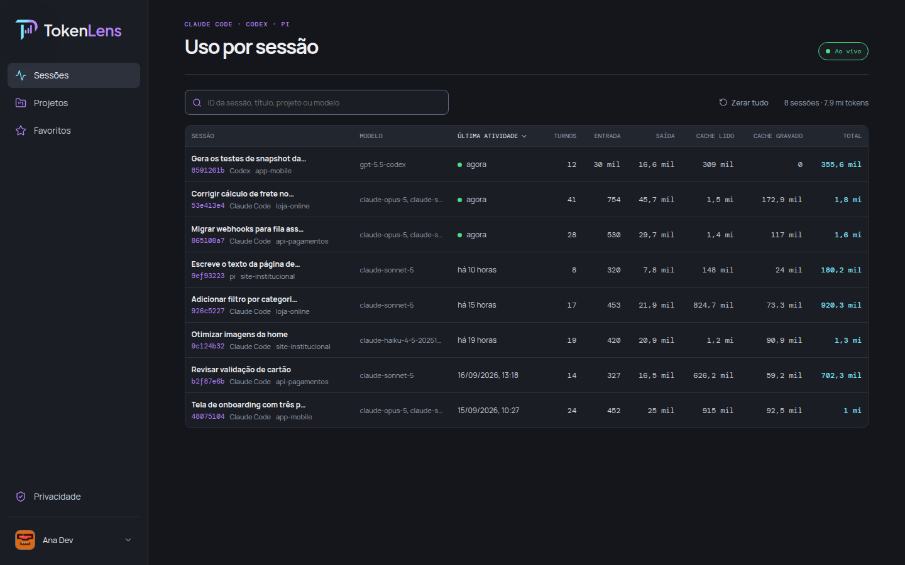
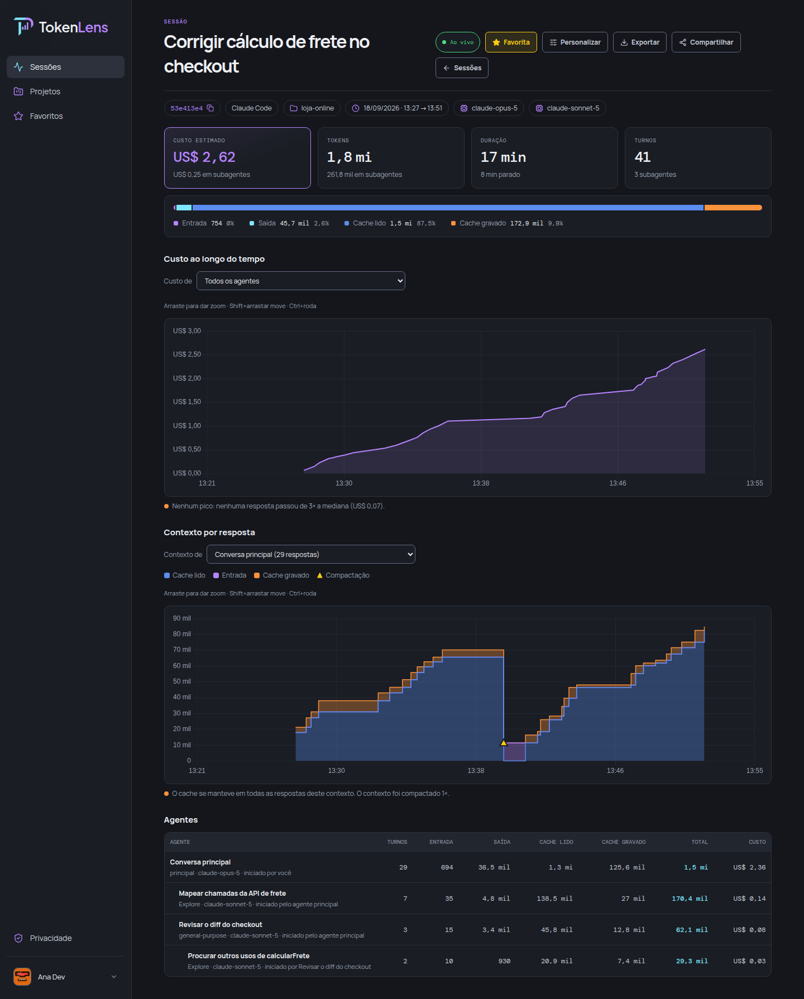
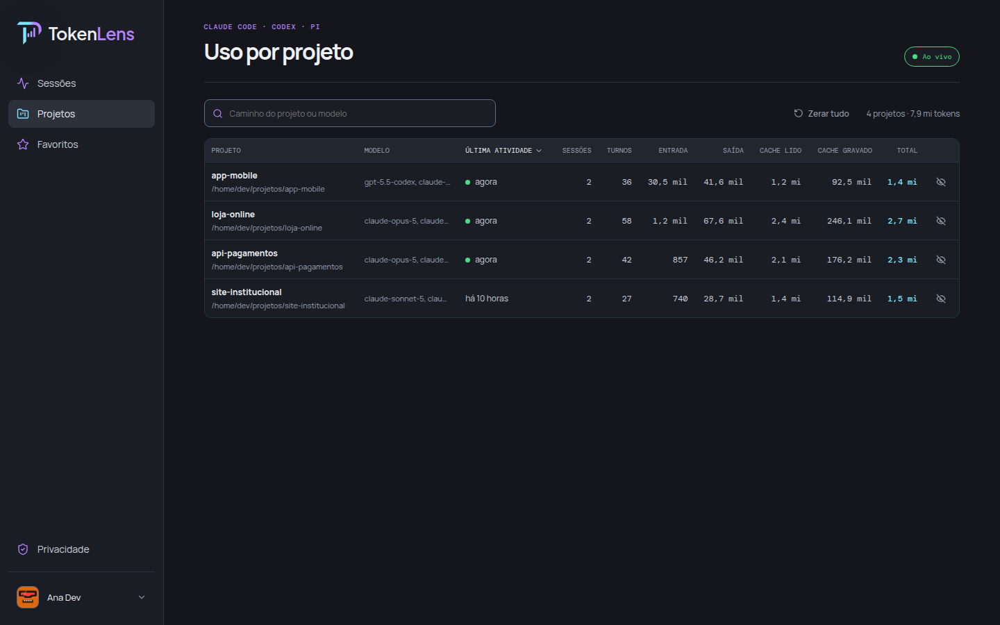
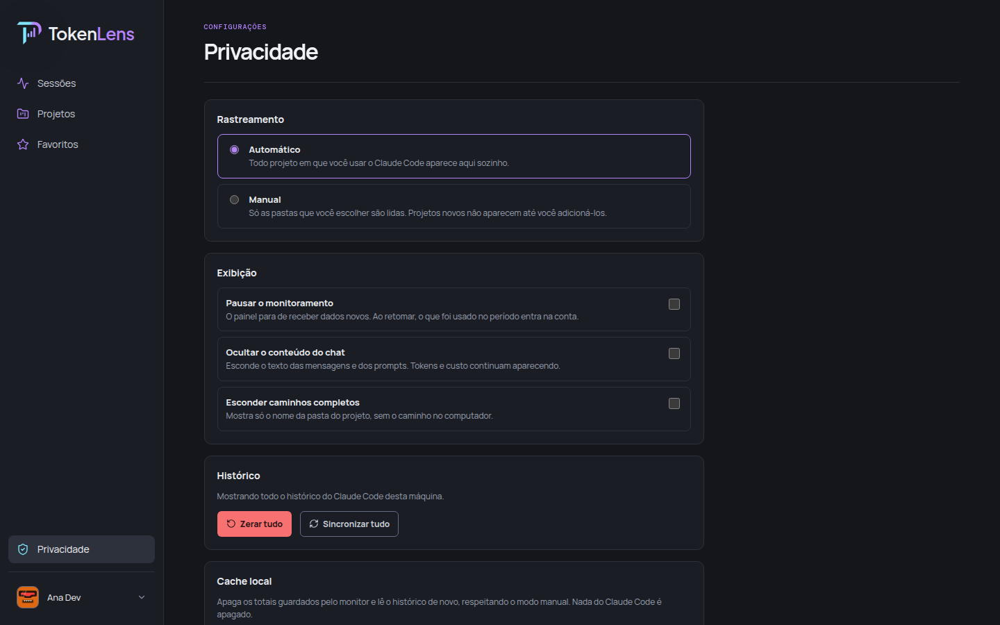
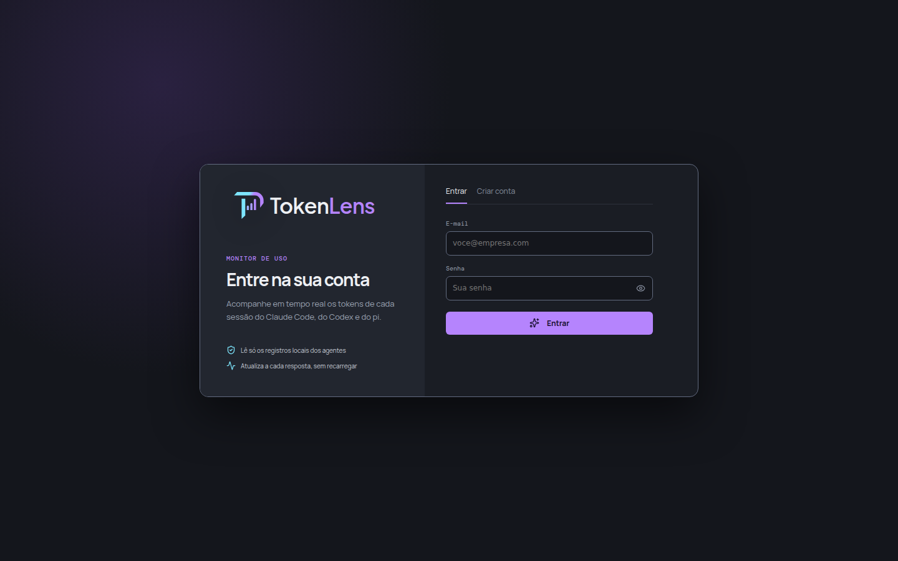

<div align="center">


### Veja, em tempo real, quantos tokens cada sessão do Claude Code, do Codex e do pi está gastando

Um painel que roda **só na sua máquina**: lê os registros que os agentes já gravam no disco,
soma tokens e custo por sessão e por projeto e atualiza a cada resposta. Sem nuvem, sem telemetria e
sem conexão externa.




</div>

---

## Sumário

- [O que ele mostra](#o-que-ele-mostra)
- [Do clone ao painel no ar](#do-clone-ao-painel-no-ar)
- [Dica: um alias para o dia a dia](#dica-um-alias-para-o-dia-a-dia)
- [App de desktop (Windows e Linux)](#app-de-desktop-windows-e-linux)
- [Como funciona](#como-funciona)
- [Por que ele não acessa a internet](#por-que-ele-não-acessa-a-internet)
- [Política de privacidade](#política-de-privacidade)
- [Configuração](#configuração)
- [Desenvolvimento](#desenvolvimento)
- [Limites conhecidos](#limites-conhecidos)
- [Contribuidores](#contribuidores)
- [Licença](#licença)

## O que ele mostra

| | |
|---|---|
| **Sessões ao vivo** | Cada sessão do Claude Code, do Codex e do pi, com entrada, saída, cache lido, cache gravado e total. A linha pisca quando chega uma resposta nova. |
| **Projetos** | Tudo o que foi gasto em cada pasta, somando as sessões. |
| **Custo ao longo do tempo** | O custo acumulado da sessão, com as respostas fora da curva marcadas. |
| **Contexto por resposta** | Quanto contexto foi enviado a cada resposta, quando o cache se perdeu (e quanto isso custou), e onde um `/compact` ou `/clear` cortou o contexto. O `/clear` abre uma sessão nova, e o gráfico leva de uma à outra. |
| **Agentes e ferramentas** | O gasto dos subagentes (e quem iniciou cada um), das ferramentas, dos MCPs, das skills, dos comandos e dos hooks. No Claude Code, cada subagente abre o próprio detalhe. |
| **Favoritos** | Marque uma sessão com a estrela e dê a ela um nome seu, para achá-la depois na página **Favoritos**. O monitor guarda uma cópia dela, que continua abrindo mesmo depois que o agente apaga a transcrição. |
| **Histórico que não some** | O Claude Code apaga sessões antigas (`cleanupPeriodDays`). A sessão apagada sai da lista, mas os números dela continuam no projeto. |
| **Sessões do Orca** | Aparecem sozinhas: o Orca roda esses mesmos CLIs, que gravam nas pastas de sempre. |

<div align="center">

<br/><sub>Detalhe de uma sessão. Os dados das capturas são fictícios.</sub>
</div>

<br/>

<table>
  <tr>
    <td></td>
    <td></td>
  </tr>
  <tr>
    <td align="center"><sub>Uso por projeto</sub></td>
    <td align="center"><sub>Privacidade: modo manual, pausa, ocultar chat e caminhos</sub></td>
  </tr>
</table>

## Do clone ao painel no ar

### 1. Pré-requisitos

| Ferramenta | Versão | Para quê |
|---|---|---|
| [Node.js](https://nodejs.org) | **24 ou superior** | Executa a API e usa o `node:sqlite` embutido. |
| [pnpm](https://pnpm.io) | 11+ | Instala as dependências (`corepack enable` já o disponibiliza). |
| `make` | qualquer | Atalhos. No Windows sem `make`, veja o [passo 3](#3-suba-o-painel). |

Você também precisa ter usado nesta máquina pelo menos um destes agentes: [Claude Code](https://claude.com/claude-code),
[Codex](https://github.com/openai/codex) ou [pi](https://github.com/earendil-works/pi).

### 2. Clone e instale

```sh
git clone git@github.com:jeffersonrucu/token-lens.git
# sem chave SSH no GitHub: gh auth login e depois
# git clone https://github.com/jeffersonrucu/token-lens.git
cd token-lens
make setup        # pnpm install + cria o .env a partir do .env.example
```

O `.env` já vem pronto para o caso comum. Só mexa nele se os agentes gravarem em outra pasta (veja
[Configuração](#configuração)).

### 3. Suba o painel

```sh
make start
```

Na primeira vez, o `make start` gera o build da página. Depois, só refaz o build quando algum arquivo
do front mudar. Em seguida, sobe **um único processo** Node, que lê os registros e serve o painel.

Abra **http://localhost:47832**.

No Windows sem `make`: `pnpm exec vite build` uma vez e depois
`set PORT=47832&& node --import tsx src/server/index.ts`.

### 4. Crie a conta e passe pelo primeiro acesso



1. Na aba **Criar conta**, informe nome, e-mail e senha. A conta existe só nesta máquina.
2. Em **Privacidade**, escolha entre ler todos os projetos (automático) ou só as pastas que você escolher (manual).
3. O monitor confere se consegue ler as pastas dos agentes.
4. Leia a política de privacidade e clique em **Concordo, abrir o painel**.

Pronto: a partir daqui, cada resposta de qualquer agente aparece no painel em até meio segundo.

### 5. Para parar

`Ctrl+C` no terminal onde o `make start` está rodando. Para não prender o terminal, use `make up`
(sobe em segundo plano, log em `start.log`) e `make down` para parar. O cache de totais é gravado antes de o
processo sair, então a próxima subida leva menos de 1 segundo.

## Dica: aliases para o dia a dia

O `make up` já sobe o painel em segundo plano. Com os aliases abaixo no `~/.zshrc` (ou no
`~/.bashrc`), você controla o TokenLens de qualquer pasta, e nenhum deles prende o terminal.

```sh
# TokenLens: everything runs in the background, so no alias holds the terminal.
TOKENLENS_DIR="$HOME/token-lens"
alias tokenlens='make -s -C "$TOKENLENS_DIR" up'
alias tokenlens-stop='make -s -C "$TOKENLENS_DIR" down'
alias tokenlens-logs='tail -f "$TOKENLENS_DIR/start.log"'
# Apaga contas, links e cache do TokenLens. O histórico dos agentes (~/.claude etc.) não é tocado.
tokenlens-destroy() {
  local answer
  printf 'Apagar ~/.tokenlens (contas, links e cache) e o start.log? [s/N] '
  read -r answer
  [ "$answer" = s ] || return 1
  make -s -C "$TOKENLENS_DIR" down >/dev/null
  # The server writes the cache on exit; deleting before that would recreate the folder.
  while pgrep -f "$TOKENLENS_DIR/[s]rc/server/index.ts" >/dev/null; do sleep 0.2; done
  rm -rf "$HOME/.tokenlens" "$TOKENLENS_DIR/start.log" && echo "TokenLens apagado"
}
```

Se você clonou em outra pasta que não `~/token-lens`, ajuste `TOKENLENS_DIR`. Se o `.env` muda
`MONITOR_DB_PATH` ou `MONITOR_CACHE_PATH`, apague esses arquivos também. Rode `source ~/.zshrc`, e
depois:

```sh
tokenlens          # sobe em segundo plano (ou só mostra a URL, se já estiver no ar)
tokenlens-stop     # derruba
tokenlens-logs     # acompanha o log (Ctrl+C sai do log, o painel continua no ar)
tokenlens-destroy  # apaga os dados do TokenLens (pede confirmação)
```

> [!NOTE]
> No macOS, troque `ss -ltn | grep -q ':47832 '` por `lsof -iTCP:47832 -sTCP:LISTEN -t >/dev/null`.

Quer abrir o navegador junto? Troque `echo "$url"` por `xdg-open "$url"` no Linux, `open "$url"` no
macOS ou `explorer.exe "$url"` no WSL.

## App de desktop (Windows e Linux)

O painel também abre como aplicativo, em janela própria, sem terminal e sem navegador. É o mesmo
servidor na mesma porta: o `make start` e o `make up` continuam valendo para quem prefere o localhost.

Para só usar, baixe da [última release](https://github.com/jeffersonrucu/token-lens/releases/latest) o
`TokenLens Setup <versão>.exe` (Windows) ou o `TokenLens-<versão>.AppImage` (Linux, `chmod +x` e pronto).
Não precisa de Node, de pnpm nem do clone do repositório. Para gerar o pacote você mesmo:

```sh
make app        # abre a janela aqui mesmo
make app-win    # gera o instalador e a versão portátil em release/
make app-linux  # gera o AppImage em release/
```

Cada pacote sai na sua própria plataforma: o `make app-win` precisa do Windows, onde o NSIS monta o
instalador, e o `make app-linux`, de um Linux. Para os dois de uma vez, use o fluxo **Desktop** do
GitHub Actions, que devolve o `.exe` e o `.AppImage` como artefatos e os anexa à release na tag.

No WSL, a janela abre pelo WSLg. O AppImage precisa de FUSE (`sudo apt install libfuse2`); sem ele,
rode com `--appimage-extract-and-run`.

Desinstalar pelo Windows apaga tudo: o programa, o perfil do Electron e o `~/.tokenlens` com as contas,
os favoritos e o cache. Atualizar para uma versão nova preserva esses dados.

Se um monitor já estiver no ar (`make up`), o app mostra esse mesmo servidor em vez de subir outro. E se a
47832 estiver ocupada — comum no Windows, onde o relay do WSL e o Hyper-V reservam faixas inteiras de
portas —, ele procura a próxima livre sozinho. Um erro na partida vai para `~/.tokenlens/desktop.log`.

### O histórico dentro do WSL

No Windows, os agentes quase sempre rodam dentro do WSL, e é lá que ficam os registros. Na primeira
abertura o app pergunta de onde ler — tudo, só o Windows ou uma distro — e guarda a resposta em
`~/.tokenlens/desktop.json`. Só entram na lista as distros que têm histórico. Para mudar depois,
**Sessões → Trocar origem…**, que refaz a pergunta e reinicia o app.

O Windows não avisa as mudanças de `\\wsl.localhost`, então essas pastas são relidas em ciclo, uma
varredura por vez: a próxima espera `MONITOR_POLL_MS` (3 s) ou o tempo que a anterior levou, o que for
maior. Cada varredura só abre o arquivo cujo tamanho mudou, e o ciclo para enquanto a janela está
minimizada — ao voltar, ela relê na hora. Janela em tela dividida ou no segundo monitor continua
atualizando normalmente. O botão ao lado do status relê o histórico na hora, a qualquer momento. A primeira leitura de um histórico grande leva alguns minutos; depois o cache
em `~/.tokenlens/usage-cache.json` deixa a abertura rápida.

## Como funciona

Os três agentes já gravam cada conversa em arquivos `.jsonl` no seu diretório pessoal. O TokenLens só
**lê** esses arquivos: acompanha o que é acrescentado, soma os tokens por sessão e envia a atualização
imediatamente ao navegador. Ele não intercepta chamadas, não atua como proxy da API e não precisa de
nenhuma chave.

Diagramas, leitura incremental e o formato de cada agente estão em
[docs/como-funciona.md](docs/como-funciona.md).

## Por que ele não acessa a internet

O TokenLens foi feito para funcionar desconectado. Isso não depende de promessa: está no código.

1. **A API só escuta em `localhost`.** Nenhum outro computador da rede alcança o painel.
2. **Tudo que a página usa vem junto com ela.** As fontes, os ícones, o gerador de avatar e o
   chart.js entram no build. Não há CDN, Google Fonts nem script de terceiros.
3. **Não há telemetria, análises, verificação de atualizações ou relatórios de erro.**
4. **A única saída é opcional:** o [compartilhamento](docs/hub.md), que só funciona depois que você
   mesmo conecta um servidor.

O diagrama da rede, os pontos exatos do código e os comandos para conferir por conta própria estão
em [docs/como-funciona.md](docs/como-funciona.md#rede-o-que-pode-sair-da-máquina).

## Política de privacidade

- O monitor **só lê** os registros que os agentes já gravam, e nunca altera nem apaga nada neles.
- Sua conta e os totais ficam em `~/.tokenlens`, **só nesta máquina**.
- Nada é enviado para fora. A única exceção é o compartilhamento, que vem desligado e, quando
  usado, leva só títulos e números, nunca chat, prompts ou caminhos.

A política completa, com os controles do painel e como apagar tudo, está em
[PRIVACY.md](PRIVACY.md). Para relatar uma falha de segurança, veja o [SECURITY.md](SECURITY.md).

## Configuração

Tudo é opcional. Copie o `.env.example` para `.env` (o `make setup` já faz isso) e descomente o que precisar.

| Variável | Padrão | Para quê |
|---|---|---|
| `CLAUDE_PROJECTS_DIR` | `~/.claude/projects` | Pasta do Claude Code. No WSL, com o Claude Code rodando no Windows: `/mnt/c/Users/<você>/.claude/projects`. |
| `CODEX_SESSIONS_DIR` | `~/.codex/sessions` | Pasta do Codex. |
| `PI_SESSIONS_DIR` | `~/.pi/agent/sessions` | Pasta do pi. |
| `MONITOR_POLL_MS` | `3000` | Intervalo para reler pastas que o sistema não avisa (WSL, drive de rede). Só vale para elas; defina a variável para forçar em qualquer pasta. |
| `MONITOR_CACHE_PATH` | `~/.tokenlens/usage-cache.json` | Cache dos totais. |
| `MONITOR_PERSIST_MS` | `60000` | Intervalo para guardar o resumo das sessões e a cópia dos favoritos. A cópia fica na pasta `favorites/`, ao lado do cache. |
| `MONITOR_DB_PATH` | `~/.tokenlens/app.db` | Banco de contas. |
| `PORT` | `47831` (`make start` usa `47832`) | Porta da API. |
| `LOG_LEVEL` | `info` | Nível de log (`warn` deixa o `start.log` mais enxuto). |

O servidor de compartilhamento tem configuração própria: veja [docs/hub.md](docs/hub.md).

## Desenvolvimento

```sh
make dev     # API em localhost:47831 (recarrega sozinha) + Vite em http://localhost:47832
make check   # testes, oxlint e build: tudo precisa passar
make help    # lista todos os comandos
```

| Comando | O que faz |
|---|---|
| `make setup` | Instala as dependências e cria o `.env` |
| `make start` | Uso diário: um processo, sem Vite, ~190 MB |
| `make up` / `make down` | O mesmo do `make start`, em segundo plano / para |
| `make dev` | Desenvolvimento, com recarga automática da API e do front |
| `make app` / `make app-win` | Abre o app de desktop / gera o instalador do Windows |
| `make test` | Testes (`node --test`) |
| `make lint` | oxlint |
| `make build` | Typecheck + build do front |

```
src/
├── App.tsx                     # rotas; as telas menos usadas carregam sob demanda
├── ui.tsx                      # componentes e estado compartilhados
├── lists.tsx, detail.tsx       # listas e detalhe da sessão, do subagente e do projeto
├── onboarding.tsx, account.tsx # primeiro acesso, conta e privacidade (sob demanda)
├── hub.tsx                     # páginas do Hub e do link compartilhado (sob demanda)
├── api.ts, chart.ts            # chamadas à API e chart.js (carregado sob demanda)
└── server/
    ├── usage.ts                # leitura incremental, cache, SSE
    ├── harnesses.ts            # adaptadores do Codex e do pi
    ├── session-detail.ts       # detalhe da sessão (gráficos, agentes, ferramentas)
    ├── pricing.ts              # tabela de preços dos modelos Claude
    ├── privacy.ts              # modos, pasta a pasta, histórico
    ├── auth.ts, database.ts    # conta local (argon2id + SQLite)
    └── shares.ts, hub.ts       # compartilhamento opcional
```

## Limites conhecidos

- O custo em dólares é calculado apenas para modelos Claude (tabela em `pricing.ts`) e para o pi, que calcula o próprio custo. Modelos do Codex aparecem como "sem preço".
- No modo manual, só as pastas do Claude Code deixam de ser lidas. O Codex e o pi são lidos integralmente e filtrados no momento da exibição.
- O formato dos `.jsonl` não é API pública de nenhum dos três agentes e pode mudar sem aviso.

## Contribuidores

<a href="https://github.com/jeffersonrucu" title="Jefferson Oliveira"></a>

## Licença

[MIT](LICENSE).
