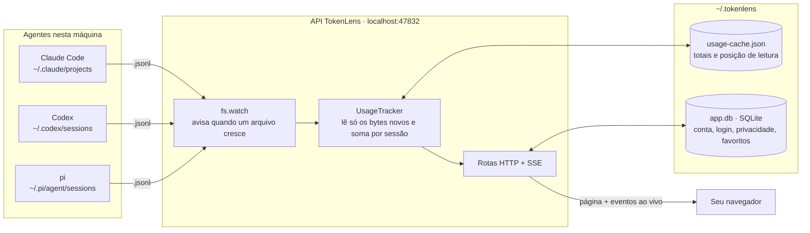
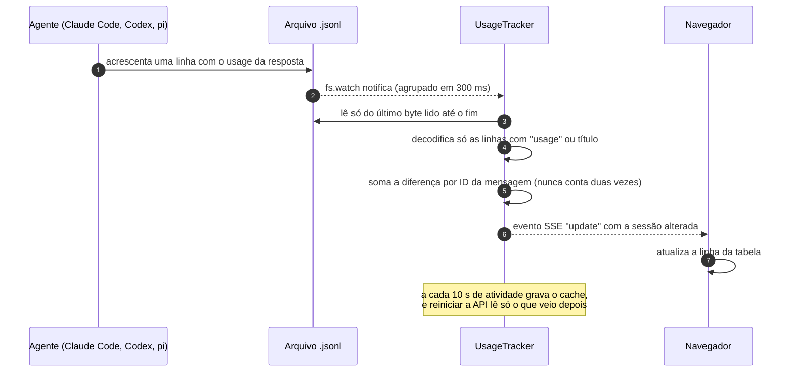
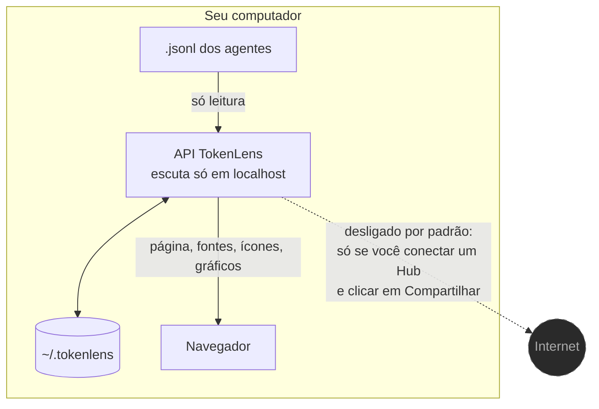

# Como o TokenLens funciona

Detalhes técnicos do monitor. Para instalar e usar, veja o [README](../README.md).

- [Arquitetura](#arquitetura)
- [O caminho de uma resposta até a tela](#o-caminho-de-uma-resposta-até-a-tela)
- [Por que é leve](#por-que-é-leve)
- [Como cada agente é lido](#como-cada-agente-é-lido)
- [Rede: o que pode sair da máquina](#rede-o-que-pode-sair-da-máquina)

## Arquitetura

Os três agentes já gravam cada conversa em arquivos `.jsonl` no seu diretório pessoal. O TokenLens só
**lê** esses arquivos. Ele não intercepta chamadas, não atua como proxy da API e não precisa de nenhuma
chave.



## O caminho de uma resposta até a tela



## Por que é leve

- **Leitura incremental.** Cada arquivo guarda a posição do último byte lido, e o que já foi somado nunca é relido.
- **Filtro antes de decodificar.** Só são decodificadas como JSON as linhas que contêm `"usage"`, título ou o contexto do arquivo. Prompts e saídas de ferramentas, que são a maior parte dos arquivos, são ignorados.
- **Cache em disco.** Com o cache, reiniciar a API leva ~0,5 s. Sem ele, ~5 s para ~2 GB de histórico.
- **Um processo só.** O `make start` roda só a API, que também serve a página: ~190 MB de RAM e 0% de CPU parado.
- **Gráficos sob demanda.** O chart.js só é baixado quando você abre o detalhe de uma sessão.
- **Detalhe em cache.** A sessão aberta fica em memória: paginar o chat ou recarregar sem mudança não relê o arquivo. Ao vivo, o detalhe é relido no máximo a cada 3 s, e transcrições longas são lidas em blocos de 4 MB.

## Como cada agente é lido

| Agente | Pasta | O que é somado |
|---|---|---|
| Claude Code | `~/.claude/projects/**` (inclui subagentes) | `message.usage` de cada resposta, uma vez por ID de mensagem |
| Codex | `~/.codex/sessions/**/rollout-*.jsonl` | Eventos `token_count`. O total acumulado evita contar a mesma resposta duas vezes, e o cache é descontado de `input_tokens`. |
| pi | `~/.pi/agent/sessions/**` | `usage` de cada resposta. O custo em dólar vem do próprio pi |

O custo dos modelos Claude é calculado pela tabela em [`src/server/pricing.ts`](../src/server/pricing.ts),
com cache de 5 min e de 1 h e o modo *fast*.

## Rede: o que pode sair da máquina



Apenas dois pontos do servidor chamam `fetch`, e nenhum deles é executado em uma instalação padrão:

| Onde | Quando roda |
|---|---|
| [`src/server/shares.ts`](../src/server/shares.ts) → `hubFetch` | Só depois que **você** conecta um Hub (URL + chave) e cria um link de compartilhamento. |
| [`src/server/mail.ts`](../src/server/mail.ts) → Resend | Só no **modo Hub** (`MODE=hub`), que é o servidor de compartilhamento e não o monitor local. |

Quer conferir por conta própria?

```sh
grep -rn "fetch(" src/server --include='*.ts' | grep -v test   # os dois pontos acima
grep -l "fonts.googleapis\|unpkg\|jsdelivr" dist/assets/*       # nenhum arquivo
ss -tnp | grep node                                              # nenhuma conexão para fora
```
