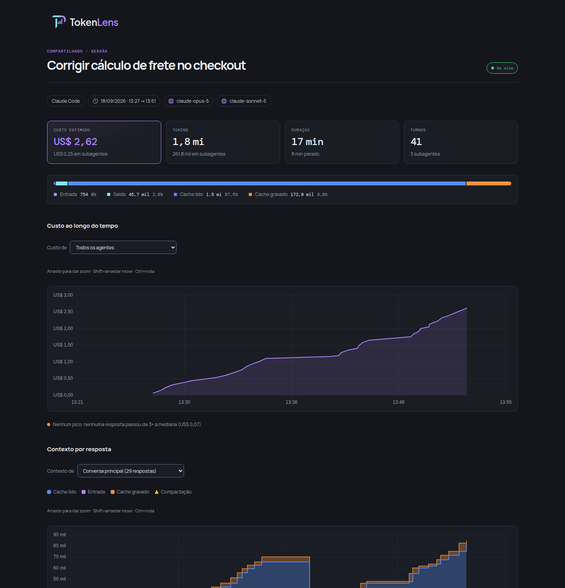
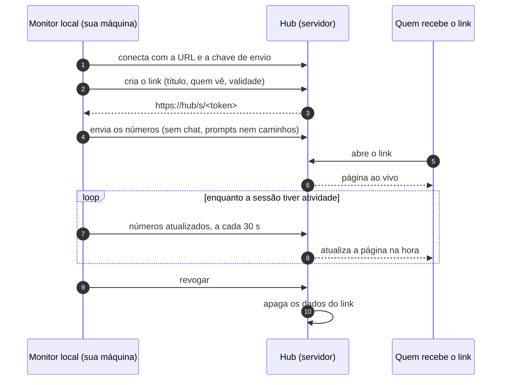
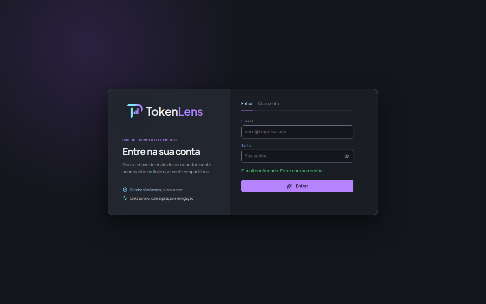
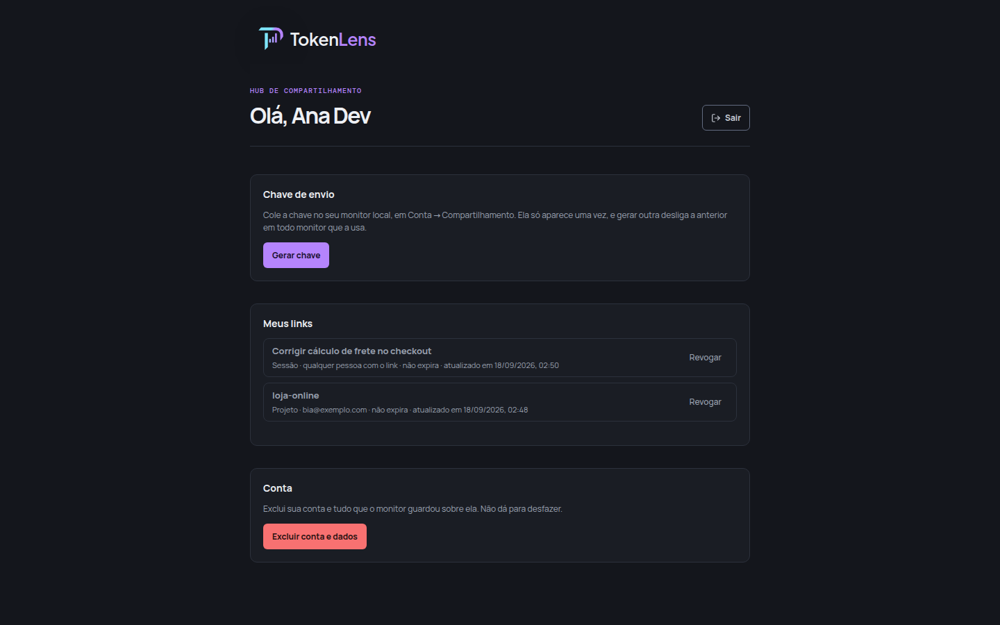

# Hub de compartilhamento

O Hub é um servidor **opcional** que permite compartilhar os gastos de uma sessão ou de um projeto
com outras pessoas. O monitor local envia para ele **apenas títulos e números**, e o Hub publica um
link ao vivo.

Quem não compartilha dados não precisa do Hub: o monitor funciona inteiramente sem ele.

<div align="center">

<br/><sub>Um link compartilhado, aberto por quem recebeu. Os dados são fictícios.</sub>
</div>

## Sumário

- [Como funciona](#como-funciona)
- [O que vai e o que não vai para o Hub](#o-que-vai-e-o-que-não-vai-para-o-hub)
- [Publicar um Hub](#publicar-um-hub)
- [Variáveis de ambiente](#variáveis-de-ambiente)
- [Testar na sua máquina](#testar-na-sua-máquina)
- [Usar o Hub](#usar-o-hub)
- [O que o Hub guarda](#o-que-o-hub-guarda)
- [Manutenção](#manutenção)
- [Problemas comuns](#problemas-comuns)

## Como funciona

O Hub usa o mesmo código do monitor, mas roda com `MODE=hub`. Nesse modo, ele **não lê nenhum
histórico local**: apenas armazena o que os monitores locais enviam e mostra os links
compartilhados.



Uma máquina roda **ou** o monitor local **ou** o Hub, nunca os dois ao mesmo tempo. O monitor fica no
computador de cada pessoa. O Hub fica em um servidor, com HTTPS e um domínio.

## O que vai e o que não vai para o Hub

| Vai | Não vai |
|---|---|
| Título do link (editável) | Chat e prompts |
| Tokens, custo e modelos | Caminhos e nomes de pastas (em links de projeto, nem o caminho do projeto é enviado) |
| Linha do tempo de custo e contexto | Descrições de tarefas dos subagentes |
| Totais por agente, ferramenta, MCP e skill | Argumentos de comandos e comandos de hooks |

O monitor remove esses dados **antes** de enviar (`shareable` em
[`shares.ts`](../src/server/shares.ts)). Ao receber, o Hub remove o chat novamente, para nunca
guardar esse conteúdo.

## Publicar um Hub

Você vai precisar de:

- um servidor Linux com **Node.js 24+**, **pnpm 11+**, **make** e **git**;
- um domínio apontando para o servidor (ex.: `tokenlens.suaempresa.com.br`);
- um proxy HTTPS na frente. Os exemplos usam o [Caddy](https://caddyserver.com), que emite o
  certificado automaticamente;
- uma conta no [Resend](https://resend.com), com o domínio do remetente verificado, para enviar os
  e-mails de confirmação e de acesso.

### 1. Instale

```sh
git clone git@github.com:jeffersonrucu/token-lens.git
cd token-lens
make setup
```

### 2. Configure o `.env`

```sh
MODE=hub
HUB_PUBLIC_URL=https://tokenlens.suaempresa.com.br
HUB_ALLOWED_EMAIL_DOMAINS=suaempresa.com.br
HUB_ALLOW_PUBLIC_SHARES=true
RESEND_API_KEY=re_xxxxxxxx
HUB_EMAIL_FROM=TokenLens <tokenlens@suaempresa.com.br>
```

> [!IMPORTANT]
> O `HUB_PUBLIC_URL` precisa ser **exatamente** o endereço público que as pessoas abrem, com
> `https` e sem barra no fim. Ele monta os links e e-mails e define a única origem aceita para login
> e escrita. Se estiver errado, o login falha com "Origem não autorizada".

Deixe o `HOST` comentado. A API escuta em `127.0.0.1`, e só o proxy na mesma máquina consegue
acessá-la.

### 3. Suba

```sh
make start   # gera o build e sobe a API servindo a página em 127.0.0.1:47832
```

Confira: `curl http://localhost:47832/health` deve responder
`{"status":"ok","service":"tokenlens"}`.

### 4. Coloque o HTTPS na frente

`/etc/caddy/Caddyfile`:

```caddy
tokenlens.suaempresa.com.br {
    reverse_proxy 127.0.0.1:47832
}
```

```sh
sudo systemctl reload caddy
```

A API e a página são servidas pelo mesmo processo, então o proxy só precisa repassar tudo. O Hub
confia nos cabeçalhos do proxy para descobrir o IP real de quem acessa; esse IP é usado pelo limite
de requisições.

<details>
<summary>Usando Nginx</summary>

```nginx
server {
    server_name tokenlens.suaempresa.com.br;
    # certificados do certbot aqui

    location / {
        proxy_pass http://localhost:47832;
        proxy_set_header Host $host;
        proxy_set_header X-Forwarded-For $proxy_add_x_forwarded_for;
        proxy_set_header X-Forwarded-Proto $scheme;
        # Links ao vivo usam SSE: sem buffer e com conexão longa.
        proxy_buffering off;
        proxy_read_timeout 1h;
    }
}
```

</details>

### 5. Deixe rodando como serviço

`/etc/systemd/system/tokenlens-hub.service`:

```ini
[Unit]
Description=TokenLens Hub
After=network.target

[Service]
User=tokenlens
WorkingDirectory=/home/tokenlens/token-lens
ExecStart=/usr/bin/make start
Restart=on-failure

[Install]
WantedBy=multi-user.target
```

```sh
sudo systemctl enable --now tokenlens-hub
journalctl -u tokenlens-hub -f   # acompanhar o log
```

Se o Node vier do `nvm`, o `systemd` não enxerga o `PATH` dele. Nesse caso, adicione
`Environment=PATH=/home/tokenlens/.nvm/versions/node/<versão>/bin:/usr/bin:/bin` em `[Service]`.

## Variáveis de ambiente

| Variável | Obrigatória | O que faz |
|---|---|---|
| `MODE` | sim | `hub` ativa o modo Hub. |
| `HUB_PUBLIC_URL` | sim | Endereço público do Hub. Monta os links e e-mails e define a única origem aceita. Sem ela, o Hub não sobe. |
| `RESEND_API_KEY` | em produção | Chave do Resend. **Sem ela, os e-mails não são enviados: só aparecem no log.** Isso serve para testes, não para produção. |
| `HUB_EMAIL_FROM` | com o Resend | Remetente, em um domínio verificado no Resend. |
| `HUB_ALLOWED_EMAIL_DOMAINS` | não | Domínios que podem criar conta, entrar e usar a chave de envio, separados por vírgula. Vazio aceita qualquer e-mail. Remover um domínio da lista encerra as sessões abertas dele. |
| `HUB_ALLOW_PUBLIC_SHARES` | não | `false` bloqueia links públicos: todo link passa a exigir uma lista de e-mails. Vale também para links criados antes. |
| `MONITOR_DB_PATH` | não | Banco do Hub (padrão: `~/.tokenlens/app.db`). |
| `LOG_LEVEL` | não | `info` por padrão. |

Quem **recebe** um link restrito pode usar qualquer e-mail: a lista de domínios vale apenas para
quem tem conta no Hub.

## Testar na sua máquina

Dá para testar o Hub inteiro sem servidor, sem domínio e sem Resend: os e-mails aparecem no log.
Pare antes o monitor local (`tokenlens-stop`), porque os dois usam a porta 47832. Use também um
banco separado para não misturar as contas:

```sh
MODE=hub HUB_PUBLIC_URL=http://localhost:47832 MONITOR_DB_PATH=/tmp/tokenlens-hub.db make start
```

1. Abra http://localhost:47832 e crie uma conta.
2. Ao subir, o log avisa `RESEND_API_KEY ausente: e-mails e códigos vão só para o log`. Depois de
   criar a conta, procure a linha `RESEND_API_KEY ausente: e-mail não enviado` e abra o link
   `…/api/v1/auth/verify?code=…` que ela mostra.
3. Entre e clique em **Gerar chave**.

Para testar a conexão com um monitor local, o Hub e o monitor precisam estar em máquinas diferentes
(ou o Hub precisa rodar em um container). O monitor só aceita `http` para um Hub em `localhost`.

## Usar o Hub

### 1. Crie a conta no Hub

Abra o endereço do Hub, vá em **Criar conta** e confirme o e-mail pelo link recebido. O link vale
por 24 horas. Se ele se perder, crie a conta de novo: a conta não confirmada é substituída.



### 2. Gere a chave de envio

Na página inicial do Hub, clique em **Gerar chave** e copie a chave (`tw_…`). Ela **aparece uma vez
só**, e o Hub guarda apenas o hash. Gerar outra chave desativa a anterior em todos os monitores que
a usavam.



### 3. Conecte o seu monitor local

No monitor, abra **Conta → Compartilhamento**, cole a URL do Hub e a chave e clique em
**Conectar**. O monitor testa a chave antes de salvar, então erros aparecem na hora.

### 4. Compartilhe

No detalhe de uma sessão ou de um projeto, clique em **Compartilhar**:

- **Título:** o sugerido é o título da sessão ou o nome da pasta. Com *Esconder caminhos completos*
  ligado, ele vira genérico, como "Sessão de 18/09/2026".
- **Quem pode ver:** *Qualquer pessoa com o link* (sem login) ou *Só estes e-mails*.
- **Expira em:** opcional.

Copie o link e envie para quem quiser. Enquanto a sessão tiver atividade, os números são atualizados
no Hub a cada 30 segundos, e quem estiver com o link aberto vê as mudanças na hora. Com o monitor
desligado, o link continua mostrando os últimos números enviados.

### 5. Acesso por e-mail

Em um link *Só estes e-mails*, quem abre informa o próprio e-mail e recebe um link de acesso que
vale **15 minutos** e **uma vez só**. Depois disso, o acesso fica liberado naquele navegador por 7
dias.

Para não revelar quem está na lista, o Hub responde da mesma forma para qualquer e-mail. Quem não
está na lista simplesmente não recebe nada.

### 6. Revogue

Revogue pelo botão **Compartilhar** no monitor ou por **Revogar** na página do Hub. Revogar apaga os
dados do link no Hub, e quem estiver com ele aberto perde o acesso na hora.

Pausar o monitoramento ou desconectar o Hub interrompe apenas o envio. Os links já criados continuam
no ar até serem revogados ou expirarem.

## O que o Hub guarda

Tudo fica em um único SQLite (`MONITOR_DB_PATH`):

| Dado | Como |
|---|---|
| Contas | Nome, e-mail e senha como hash **argon2id**. |
| Chave de envio | Apenas o hash. |
| Links | Título, quem pode ver, validade e o último envio de números. O token do link fica apenas como hash. |
| Acessos por e-mail | O e-mail de quem recebeu o acesso, por 7 dias, e o código (hash), por 15 minutos. |

**Excluir a conta** na página do Hub apaga a conta, a chave e todos os links dela.

## Manutenção

- **Backup:** copie o arquivo do banco (`~/.tokenlens/app.db` ou o `MONITOR_DB_PATH`).
- **Atualizar:** `git pull && sudo systemctl restart tokenlens-hub`. O `make start` refaz o build se
  o front mudou.
- **Saúde:** `GET /health`.

## Problemas comuns

| Mensagem | Causa e solução |
|---|---|
| "MODE=hub exige HUB_PUBLIC_URL no .env" (ao subir) | Falta o `HUB_PUBLIC_URL` no `.env`. Preencha e suba de novo. |
| "Origem não autorizada para esta ação." | O `HUB_PUBLIC_URL` não bate com o endereço aberto no navegador. Corrija e reinicie. |
| "Use uma URL https." (no monitor) | O monitor só aceita `http` para um Hub em `localhost`. Use o endereço `https`. |
| "O hub recusou a chave." | A chave está errada ou foi substituída. Gere outra no Hub e conecte de novo. |
| "Não foi possível falar com o hub." | URL errada, Hub fora do ar ou sem rede. Teste com `curl https://seu-hub/health`. |
| "Confirme seu e-mail antes de entrar." | Falta abrir o link de confirmação. Sem `RESEND_API_KEY`, ele aparece no log. |
| "Use um e-mail de um domínio autorizado." | O domínio não está em `HUB_ALLOWED_EMAIL_DOMAINS`. |
| "Links públicos estão desativados neste hub." | `HUB_ALLOW_PUBLIC_SHARES=false`. Use a lista de e-mails. |
| "Link inválido, expirado ou revogado." | O link foi revogado, expirou ou o token está incompleto. |
| Link ao vivo não atualiza atrás do Nginx | Falta `proxy_buffering off` (veja a configuração do Nginx acima). |
